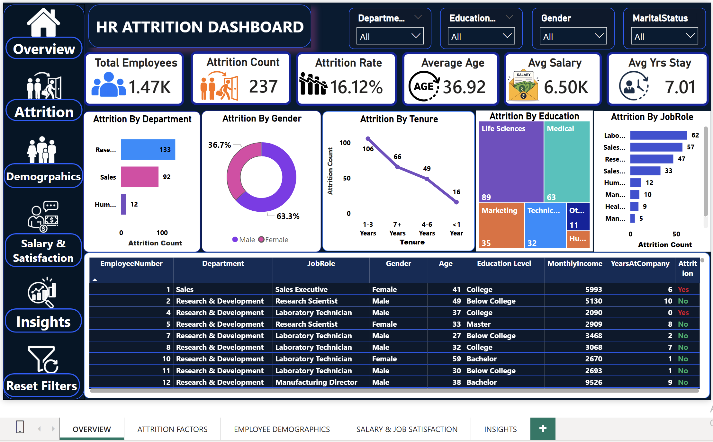
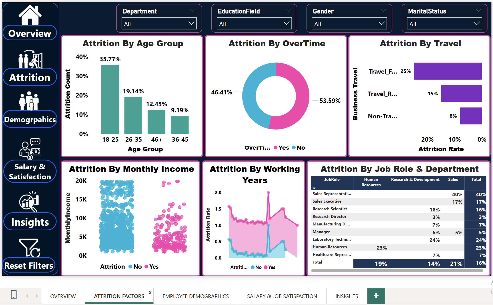
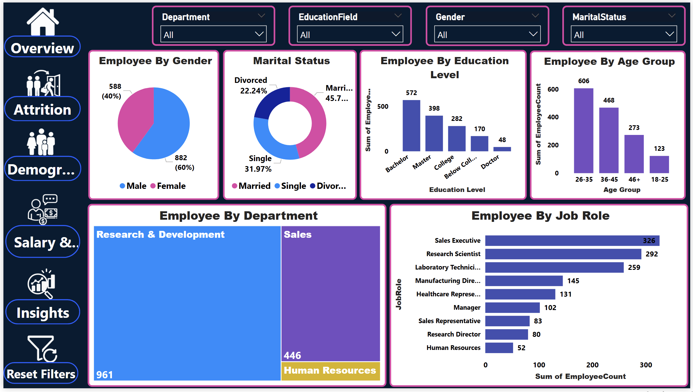
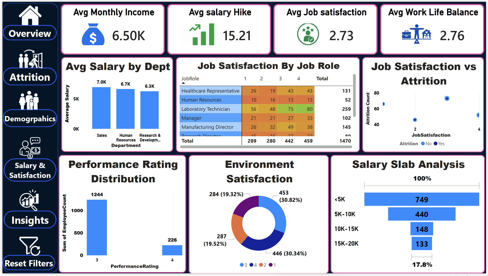
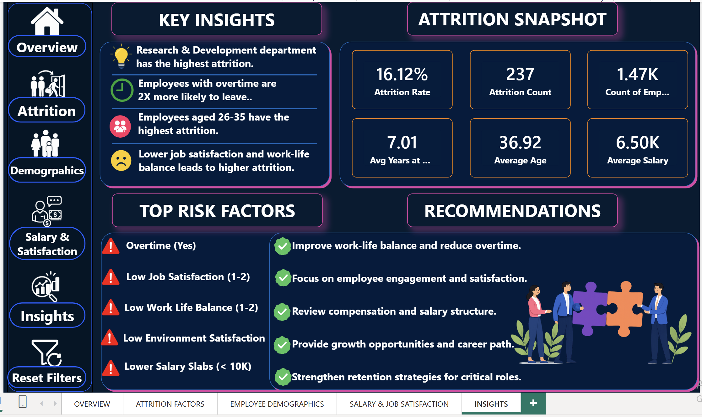

# HR Employee Attrition Analysis & Dashboard

Power BI | SQL | Python | DAX | Power Query

## Description

This project analyzes employee attrition patterns using HR data and provides actionable business insights through Exploratory Data Analysis (EDA), SQL analysis, and an interactive Power BI dashboard.

The objective was to identify factors contributing to employee turnover and support data-driven retention strategies.

---

## Tools & Technologies

- Python
- Pandas
- NumPy
- Matplotlib
- Seaborn
- SQL
- Power BI
- Power Query
- DAX
- Excel

---

## Dataset Information

- 1,470 Employee Records
- Employee Demographics
- Salary Information
- Job Roles
- Department Data
- Attrition Status
- Work-Life Balance
- Overtime Information

---

## Project Workflow

1. Data Collection
2. Data Cleaning
3. Exploratory Data Analysis (EDA)
4. SQL-Based Business Analysis
5. Dashboard Development
6. Business Insights & Recommendations

---

## Key Insights

- Overall Attrition Rate: 16.2%
- Sales Department showed the highest attrition
- Employees earning below $3K/month were 2x more likely to leave
- Overtime employees had significantly higher attrition rates
- Average Employee Tenure: 7.1 Years

---

## Dashboard Features

- Attrition Analysis
- Department-wise Insights
- Salary Trend Analysis
- Job Role Analysis
- Interactive Filters & Slicers
- KPI Cards
- Workforce Distribution Analysis

---

## Repository Structure

```text
HR_ATTRITION_FINAL_DASHBOARD.pbix
README.md
```
---

## Dashboard Screenshots

### Overview Dashboard


### Attrition Factors Analysis


### Employee Demographics


### Salary & Job Satisfaction Analysis


### Key Insights & Recommendations

